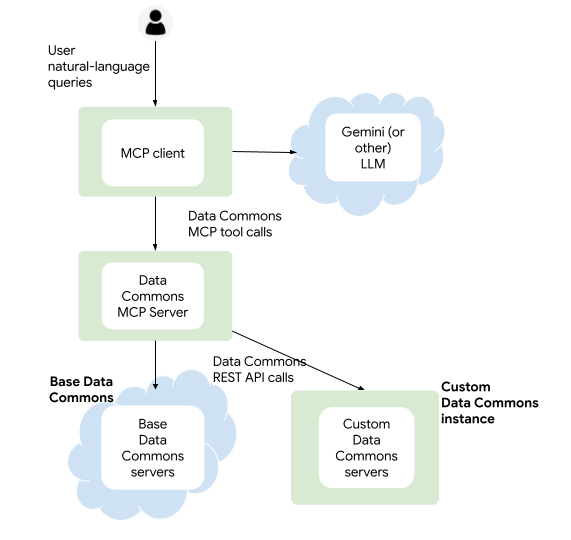

# Introducing Data Commons MCP server

* TOC

## Overview

The Data Commons Model Context Protocol (MCP) Server gives AI agents access to the Data Commons knowledge graph and returns data related to statistical variables, topics, and observations. It allows end users to formulate complex natural-language queries interactively, get data in textual, structured or unstructured formats, and download the data as desired. For example, you can answer high-level questions such as "give me the economic indicators of the BRICS countries", view simple tables, and download a CSV file of the data in tabular format.

The MCP Server returns data from the "base" instance (in datacommons.org) or, if configured, a Custom Data Commons instance. 

The server is a Python binary based on the [FastMCP 2.0 framework](https://gofastmcp.com). It runs in a Python virtual environment. A prebuilt package is available at https://pypi.org/project/datacommons-mcp/.

At this time, there is no centrally deployed server; you run your own server, and any client you want to connect to it.



### Tools

The server currently supports the following tools:

- `search_indicators`: Searches for available variables and/or topics for a given place or metric. Topics are only relevant for Custom Data Commons instances that have implemented them.
- `get_observations`: Fetches statistical data for a given variable and place.
- `validate_child_place_types`: Validates child place types for a given parent place.

Tool APIs are defined in https://github.com/datacommonsorg/agent-toolkit/blob/main/packages/datacommons-mcp/datacommons_mcp/server.py.

### Clients

To connect to the Data Commons MCP Server, you can use any available AI application that supports MCP, or your own custom agent. 

The server supports both standard MCP transport protocols:
- Stdio: For clients that connect directly using local processes
- Streamable HTTP: For clients that connect remotely or otherwise require HTTP (e.g. Typescript)

See [Basic usage](#basic) below for how to use the server with Google-based clients over Stdio.

For an end-to-end tutorial using a server and agent over HTTP, see the sample Data Commons [Colab notebook]()

### Unsupported features

At the current time, the following are not supported:
- Non-geographical ("custom") entities
- Events
- Exploring nodes and relationships in the graph

{#basic}
## Basic usage: run a local agent and server

Below we provide specific instructions for locally running agents:
- [Gemini CLI](https://github.com/google-gemini/gemini-cli) -- best for playing with the server; requires minimal setup
- A sample agent based on the Google [Agent Development Kit](https://google.github.io/adk-docs/) and [Gemini Flash 2.5](https://deepmind.google/models/gemini/flash/) -- best for interacting with a sample ADK-based web agent; requires some additional setup

Both spawn the server in a local subprocess.

### Prerequisites

- Data Commons API key. To obtain an API key, go to <https://apikeys.datacommons.org> and request a key for the `api.datacommons.org` domain.
- For Gemini CLI, install [`node.js`](https://nodejs.org/en/download).
- For Gemini CLI or running the sample agent locally, install `uv`, for installing and running Python packages; see the instructions at <https://github.com/astral-sh/uv/blob/main/README.md>. 
- For running the sample agent locally, install [Git](https://git-scm.com/).

{#vars}
### Configure environment variables

You configure the server using environment variables. All supported options are documented in https://github.com/datacommonsorg/agent-toolkit/blob/main/packages/datacommons-mcp/.env.sample. 

For basic usage against datacommons.org, juset set the required `DC_API_KEY` in your shell/startup script (e.g. `.bashrc`).

If you're running a against a custom Data Commons instance, or otherwise setting several variables, we recommend using a `.env` file, which the server locates automatically, to keep all the settings in one place. To do so:

1. From Github, download the file [`.env.sample`](https://github.com/datacommonsorg/agent-toolkit/blob/main/packages/datacommons-mcp/.env.sample) to the desired directory. 

    > Tip: If you're planning to run the sample agent, clone the repo https://github.com/datacommonsorg/agent-toolkit/.

1. From the directory where you saved the sample file, copy it to a new file called `.env`. For example:
   ```
   cd ~/agent-toolkit/packages/datacommons-mcp
   cp .env.sample .env
   ```
1. Set the required variable `DC_API_KEY` to your Data Commons API key, and any other optional variables. If you are using a Custom Data Commons instance, be sure to set `DC_TYPE` to `custom` and uncomment and set `CUSTOM_DC_URL` to the URL of your instance. 

### Use Gemini CLI

To install Gemini CLI, see instructions at https://github.com/google-gemini/gemini-cli#quick-install. 

We recommend that you use the Gemini API key [authentication option](https://github.com/google-gemini/gemini-cli?tab=readme-ov-file#-authentication-options) if you already have a Google Cloud Platform project, so you don't have to log in for every session. To do so:
1. Go to https://aistudio.google.com/ and create a key. 
1. Set the follwing environment variable:
   ```
   export GEMINI_API_KEY="<YOUR KEY>"
   ```

To configure Gemini CLI to recognize the Data Commons server, edit your `~/.gemini/settings.json` file to add the following:

```json
{
  ...
  "selectedAuthType": "gemini-api-key",
  "mcpServers": {
    "datacommons-mcp": {
      "command": "uvx",
      "args": [
        "datacommons-mcp@latest",
        "serve",
        "stdio"
      ],
      "env": {
        "DC_API_KEY": "<YOUR API KEY>"
      }
    }
  }
}
```
If desired, you can modify the following settings:
- `selectedAuthType`: If you don't have a GCP project and want to use OAuth with your Google account, set this to `oauth-personal`.
- `command`: If you want to run packages from locally cloned stored Python code, set this to `uv` and add `run` to the list of `args`, 

You can now run the `gemini` command from any directory and it will automatically kick off the MCP server, with the correct environment variables.

Once Gemini CLI has started up, you can immediately begin sending natural-language queries! 

> **Tip!**: To ensure that Gemini CLI uses the Data Commons MCP tools, and not its own `GoogleSearch` tool, include a prompt to use Data Commons in your query. For example, use a query like "Use Data Commons tools to answer the following: ..."  You can also add such a prompt to your [`GEMINI.md` file](https://codelabs.developers.google.com/gemini-cli-hands-on#9) so that it's persisted across sessions.

{#sample}
### Use the sample agent

xxx is a basic agent for interacting with the MCP Server. To run it locally:

1. Clone the Data Commons `agent-toolkit` repo: from the desired directory where you would like to save the code, run:
   ```
   git clone https://github.com/datacommonsorg/agent-toolkit.git
   ```
1. When the files are downloaded, navigate to the subdirectory `packages/datacommons_agents/`. For example
   ```
   cd ~/agent-toolkit/packages/datacommons_agents/
   ```
1. Copy the `.env_sample` file to a new file `called `.env`:
   ```
   cp .env.sample .env
   ```
1. Set the required variables and save the file.
1. Run the following command to start the web agent and server:
   ```
   uv run adk web ./datacommons-agents
   ```
1. 

## Develop your own ADK agent

We provide two sample Google Agent Development Kit-based agents you can use as inspiration for building your own agent:

- [Building a Data Commons MCP Agent]() is a Google Colab tutorial that shows how to build an HTTP-based agent step by step. 
- The sample [basic agent]() is a simple Stdio-based agent. To develop against it, see [Use the sample agent](#sample) above.

{: #standalone}
## Use a remote server/client

### Run a standalone server

To install packages from PyPi:
1. Go to the directory where your `.env` file is stored (e.g. `agent-toolkit/packages/datacommons-mcp`).
1. Run the following command:
   ```
   uvx datacommons-mcp serve <PROTOCOL> [--port <PORT>]
   ```
To install packages from local code (cloned from Github):
1. Go to the server project directory:
   ```
   cd agent-toolkit/packages/datacommons-mcp
   ```
1. If using an `.env` file, ensure that it is present in the directory.
1. Run the following command:
   ```
   uv run datacommons-mcp serve <PROTOCOL> [--port <PORT>]
   ```
The _PROTOCOL_ is one of:
- `stdio`: suitable for most locally running clients
- `http`: suitable for remote clients or other clients that require HTTP. 

By default, the port is 8080 if you don't set it explicitly.

The server is addressable with the endpoint `mcp`. For example, to point a locally running client to the server, you can use http://localhost:8080/mcp.

### Connect to an already-running server from a remote client

The way to connect to the server from a remote client is different from client to client; see your client's documentation for specific procedures. Below we provide instructions for Gemini CLI and for the Google-ADK-based sample agent.

#### Gemini CLI

To configure Gemini CLI to connect to a remote Data Commons server, in your `~/.gemini/settings.json` file, add the following:

```json
{
...
"mcpServers": {
    "datacommons-mcp": {
      "httpUrl": "http://<HOST>:<PORT>/mcp"
    }
    ...
  }
}
```

#### Sample agent

To configure the sample agent xxx to connect to a remote Data Commons server, edit the file `agent.py` 


